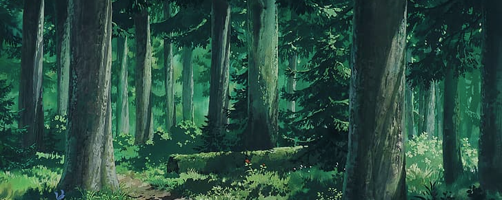

<h2>Hi! 👋 I'm Aaron Steed</h2>

</img>
Senior Software Engineer @ Riot Games.

From County Wicklow, known to many as the garden of Ireland 🇮🇪

Visit <a href="https://aaronsteed.io">aaronsteed.io</a> for my <a href="https://aaronsteed.io/documents/2025x-CV.pdf"">resume</a> and more info on my work.

I love playing all types of games (video games and board games, especially card games and CCGs), baking sourdough bread, running and hiking

 

### Socials

### Technologies, languages and frameworks
> All the below I either still use currently or have worked with and used in a significant capacity in a previous role
#### Web Development

  

#### Backend Development

  

#### Tools of choice

  

#### Image Credit
- [Banner](https://www.wallpaperflare.com/studio-ghibli-forest-clearing-landscape-oak-nature-wallpaper-ytwiq)